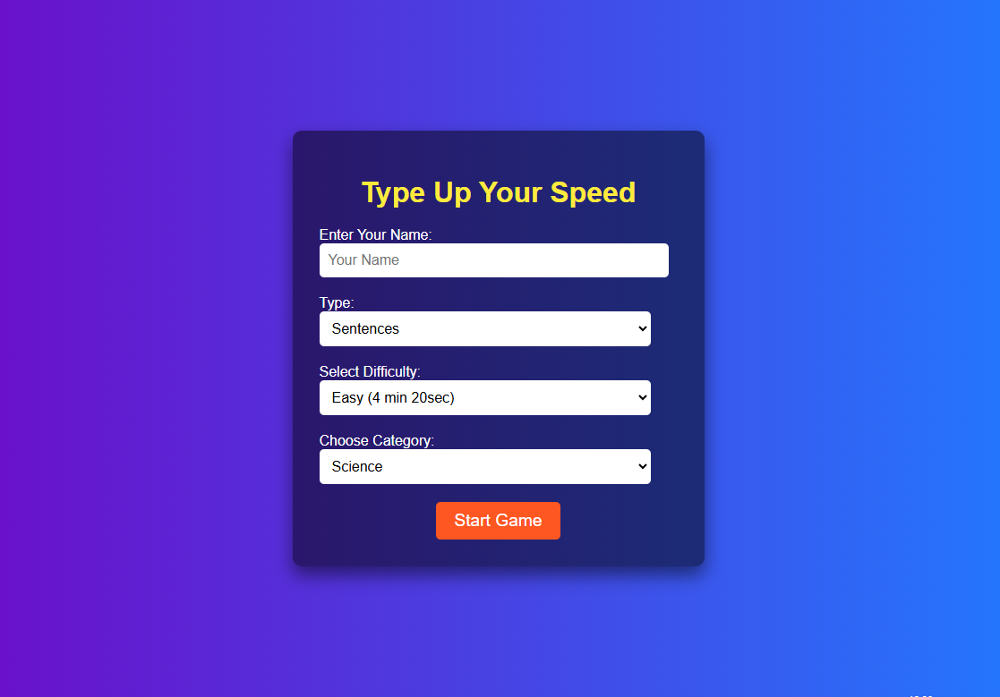

# 🖱️ **Enhance Your Typing Speed** ⌨️

Welcome to **Enhance Your Typing Speed**, a unique web application designed to help you learn **typing faster** by typing words of different lengths and sentences rather than paragraphs! 🚀

At **Enhance Your Typing Speed**, we believe in improving your typing skills through focused practice with **individual words and individual sentences**. Unlike other websites that require you to type long paragraphs, we make it a **faster and more efficient process** by encouraging you to type words of varying lengths and many categorised sentences. This way, you can gradually increase your typing speed without getting overwhelmed!

---

## **Why Choose Us?**

We focus on providing a **streamlined typing experience**, which includes:
- **Various Format**: Choose any fromat "Words" format or "Sentences" format and start progressing.
- **Various Difficulty Levels**: Choose the difficulty that fits your current skill and progress at your own pace.
- **Different Word Styles, Sentences and Variants**: Engage with a wide range of typing styles and variations for a fun experience.
- **Continuous Updates**: We strive to improve this application with each new version. Stay tuned for upcoming features!

---

## 🚀 **Update v.2: New Features & Improvements!** 🎉

Thank you all for your amazing feedback! Based on popular demand, I’m excited to announce **Update v.2** of **Enhance Your Typing Speed**. While the **Words Section** is temporarily unavailable, we've introduced new, exciting features that will make your typing experience even better. Let’s dive into the latest updates:

---

### 📝 **New Features**  

💬 **Sentence Mode Expanded**  
- **Different Categories for Sentences:** Now you can type sentences from a variety of categories, making your practice more diverse and engaging! 🌍  
- **Challenge Yourself:** With the new difficulty settings, you’ll find the timer challenge has been adjusted to provide a more **dynamic** and **challenging** experience. ⏳

---

## 🚀 **How to Use:**

1. **Select Type**: Select any type you want to continue with.
2. **Select Difficulty**: Start with an easy level and gradually increase the difficulty as you improve.
3. **Select Category**: Now select what type of sentences you want to practice with.
4. **Start Typing**: Now start typing and try your best to maximize your typing efficiency.
5. **Track Progress**: Keep an eye on your speed and accuracy to see how you're improving.
6. **Get Better Over Time**: With consistent practice, you'll see rapid improvements in your typing speed.

---

### 🎉 **Big Thanks!**  
A special shoutout to **@hackclub** for motivating me to push this update forward. Without their support, this update wouldn’t have been possible. 🙌

---

### ⚙️ **What's Coming Next?**  

🏆 **Leaderboard Coming Soon:**  
- Get ready to compete with others! The leaderboard feature will be added soon, so you can track your progress and see how you stack up against other users.  

🔄 **The Return of Words Section:**  
- The much-requested **Words Section** will be coming back in future updates, so stay tuned for that!

---

## **Check Out the Project:**

👉 [Enhance Your Typing Speed on GitHub](https://diptanu761.github.io/Enhance-Your-Typing-Speed/)

---

## **Screenshots & Video Preview**

### Screenshots:
Here’s a preview of the website:

### Video Preview:
Watch this video to get an overview of the website's features:

## 📢 **Feedback & Suggestions**  

I’m eager to know your thoughts!  
💬 **Have suggestions or ideas to make it better?** Let me know by submitting an issue or connecting with me on Instagram.

## 💡 **How to Contribute**  

🤝 **Contributions are always welcome!**  
Want to make the game better? Add features, optimize the code, or fix bugs. Fork the repo and start contributing:  
[Contribute Now!](https://github.com/Diptanu761/Enhance-Your-Typing-Speed)

📲 **Follow Me:**  
  

---

## **Thanks for Trying!**  
I appreciate your support and feedback. Together, let’s make typing fun and faster than ever before! 🌟

---
