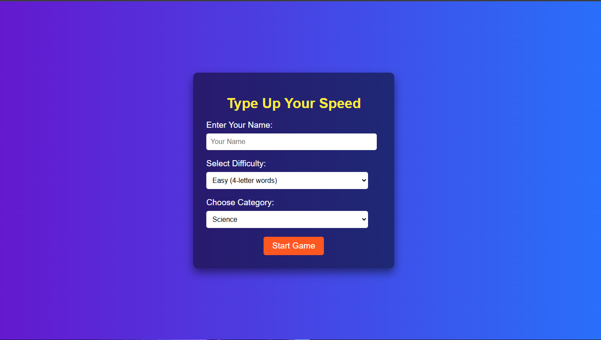

# **Enhance Your Typing Speed** 🌟

Welcome to **Enhance Your Typing Speed**, a unique web application designed to help you learn **typing faster** by typing words of different lengths rather than paragraphs! 🚀

At **Enhance Your Typing Speed**, we believe in improving your typing skills through focused practice with **individual words**. Unlike other websites that require you to type long paragraphs, we make it a **faster and more efficient process** by encouraging you to type words of varying lengths. This way, you can gradually increase your typing speed without getting overwhelmed!

---

## **Why Choose Us?**

We focus on providing a **streamlined typing experience**, which includes:
- **Various Difficulty Levels**: Choose the difficulty that fits your current skill and progress at your own pace.
- **Different Word Styles and Variants**: Engage with a wide range of typing styles and variations for a fun experience.
- **Continuous Updates**: We strive to improve this application with each new version. Stay tuned for upcoming features!

---

## **What’s New in Version 1.0?**

This is the first version of **Enhance Your Typing Speed**, and I’m excited to share it with you all! Here's what you can expect:
- **Simple yet effective design**: Focuses on improving typing speed with minimal distractions.
- **Personalized challenges**: Test your limits by increasing the difficulty of the words you type.
- **Engaging user experience**: Each word variant and difficulty level is designed to be both **challenging and fun**.

---

## **How to Use:**

1. **Select Difficulty**: Start with an easy level and gradually increase the difficulty as you improve.
2. **Type Words**: Focus on typing words, not long paragraphs, to maximize your typing efficiency.
3. **Track Progress**: Keep an eye on your speed and accuracy to see how you're improving.
4. **Get Better Over Time**: With consistent practice, you'll see rapid improvements in your typing speed.

---

## **Next Steps:**

This is just **Version 1.0**, and there’s a lot more coming in future releases! 🔥 I'm constantly working on improvements and adding new features. I’m eager to hear your suggestions and feedback—so don’t hesitate to reach out and let me know how I can make this website even better! 🙌

---

## **Check Out the Project:**

👉 [Enhance Your Typing Speed on GitHub](https://diptanu761.github.io/Enhance-Your-Typing-Speed/)

---

## **Follow Me:**

Stay updated and connect with me on **Instagram**! 📱  
👉 [Follow me on Instagram](https://www.instagram.com/iamdev7601?igsh=am93cHc1dGs1dGxq)

---

## **Thanks for Trying!**  
I appreciate your support and feedback. Together, let’s make typing fun and faster than ever before! 🌟

---

## **Screenshots & Video Preview**

### Screenshots:
Here’s a preview of the website:

### Video Preview:
Watch this video to get an overview of the website's features:

